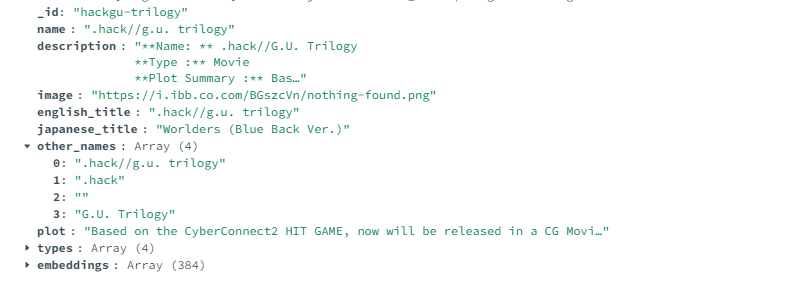

## Anime Semantic Search

This project implements a semantic search system for anime titles using Sentence Transformers and MongoDB's vector search index. It enables users to find similar anime based on text queries rather than keyword matching.

## Strategy

An anime can have different titles (Japanese and English), although most of time they are same. I am creating vector embedding based on English and Japanese titles (joining them).

We are using `sentence-transformers/all-MiniLM-L6-v2` since its free to use and there's no limitations.

Initially, I thought about using GEMINI's free embeddings. But later changed my mind as it has limitations (`15 reqs/min` and `1500reqs/day`). Still, the code for using Gemini instead of sentence-transformers is still there, commented in `create_embeddings.py`

Gemini generates embeddings with `3072` dimensions,
sentence-transformers generates `384` dimensions.

## MongoDB Vector Search Index

Here is a snapshot of a document from the collection:

(In case you have OCD, I know `_id` should've been of type `ObjectID`, but I scraped this database years ago)

Mongodb vector search index should have some similar configurations:

```json
{
  "fields": [
    {
      "numDimensions": 384,
      "path": "embedding",
      "similarity": "dotProduct",
      "type": "vector"
    }
  ]
}
```

## Environment Variables

`GEMINI_API_KEY`: API key from [Google AI Studio](https://aistudio.google.com/app/apikey) if Gemini is preferred over `sentence-transformers` \
`MONGODB_URI`: MongoDB connection string

## Setup

Install dependencies:

```sh
pip install -r requirements.txt
```

Create pre-train/populate db with embeddings:

```sh
python3 add_embeddings_to_db.py
```

Search:

```sh
python3 main.py
```

## Final Thoughts

I made this project to learn and practice Vector Embeddings and Semantic Search. This probably has no use for you.

## License

This project is open-source and available under the [MIT License](LICENSE).
